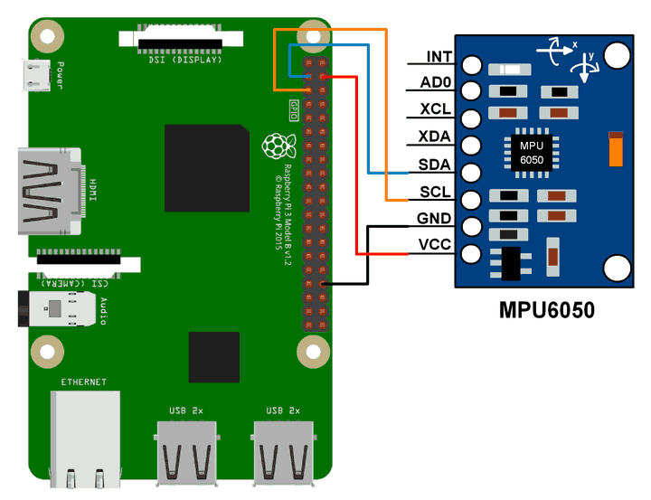

# MPU6050

This module is a part of `i2cdevlib-pi` library. Please follow [this instruction](https://github.com/mrlordkaj/i2cdevlib-pi#installation) to install the library.

## Getting Started

Let's write your first app which shows raw data from `MPU6050` device!

Connect your MPU6050 device to the Raspberry Pi board:


Create new file named [mpu_raw.cpp](docs/mpu_raw.cpp) and write its code:
```c++
#include <unistd.h> // standard libs
#include <Arduino.h> // abstract layer
#include <i2cdevlib/MPU6050.h>

int main() {
    int16_t ax, ay, az; // accelerometer raw
    int16_t gx, gy, gz; // gyroscope raw
    MPU6050 mpu;
    mpu.initialize();
    if (mpu.testConnection()) { // test sensor connection
        while (true) {
            mpu.getMotion6(&ax, &ay, &az, &gx, &gy, &gz); // get raw data
            printf("a/g: ");
            printf("%6d %6d %6d / ", ax, ay, az);
            printf("%6d %6d %6d\r\n", gx, gy, gz);
            fflush(stdout); // force show new line
            sleep(1); // sleep 1 second
        }
    } else {
        fprintf(stderr, "MPU6050 connection failed");
        return 1;
    }
    return 0;
}
```

Build the code:
```
$ g++ mpu_raw.cpp -o mpu_raw -li2cdev
```

And run it:
```
$ ./mpu_raw
```

## Build Demos

This module comes with 3 built-in demos `raw`, `dmp6`, and `teapot`. Make sure you are working on `MPU6050` directory, then run build commands:
```
$ make CONF=raw

$ make CONF=dmp6

$ make CONF=teapot
```

After `make` processes all done, executable demos will be ready in `MPU6050/dist` directory.